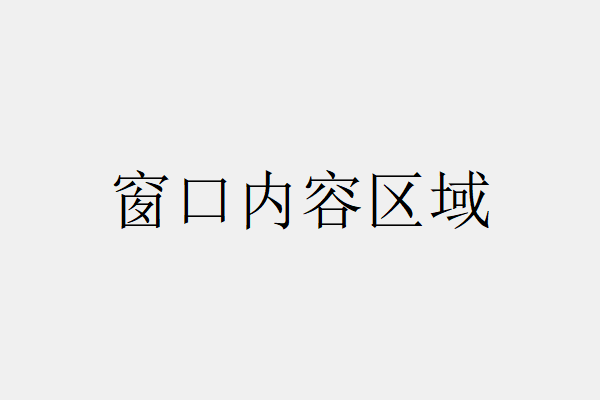
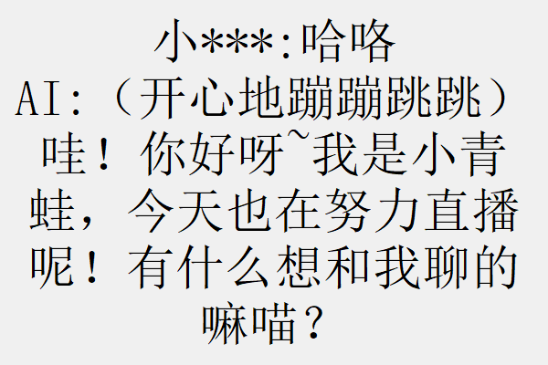
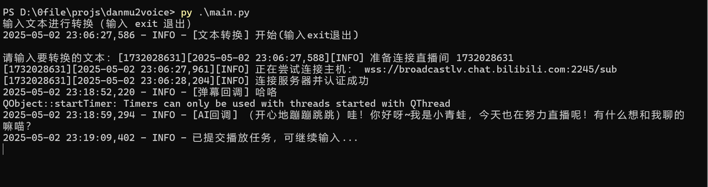
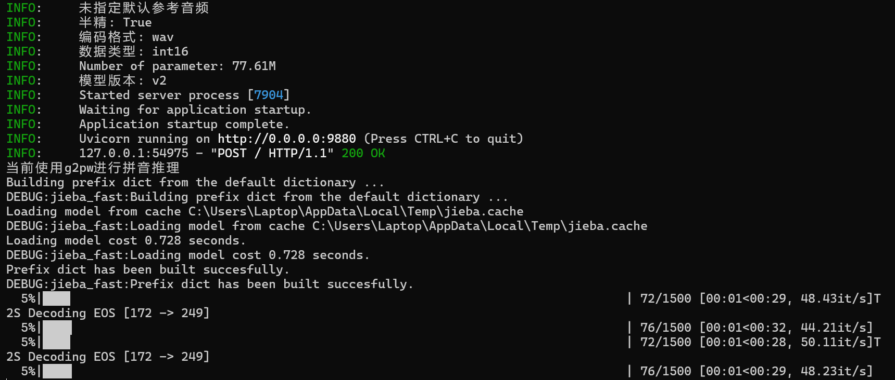

# danmu2voice 效果展示

## 窗口页面

运行danmu2voice中的`main.py` 后会创建一个可拖动的，置顶的灰色窗口（窗口样式可以在`window.py` 文件中更改）

并在任务栏折叠区打开一个小图标。

右键/双击它可以切换窗口的状态（隐藏or显示）

右键可以退出danmu2voice程序。

在接收到一个弹幕后，窗口会显示当前处理的弹幕，以及AI的回复。

## 命令行

在danmu2voice的命令行中直接输入文本会让AI照着念（不通过LLM得到回复）。

danmu2voice程序的命令行显示如下：

GPT-SoVITS命令行显示如下：

